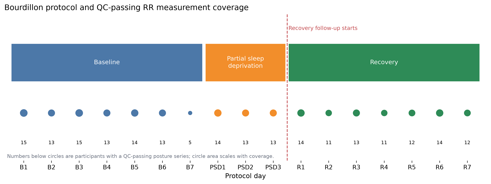
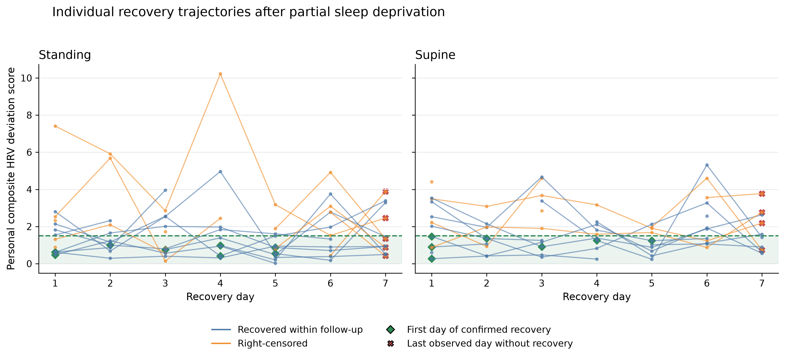
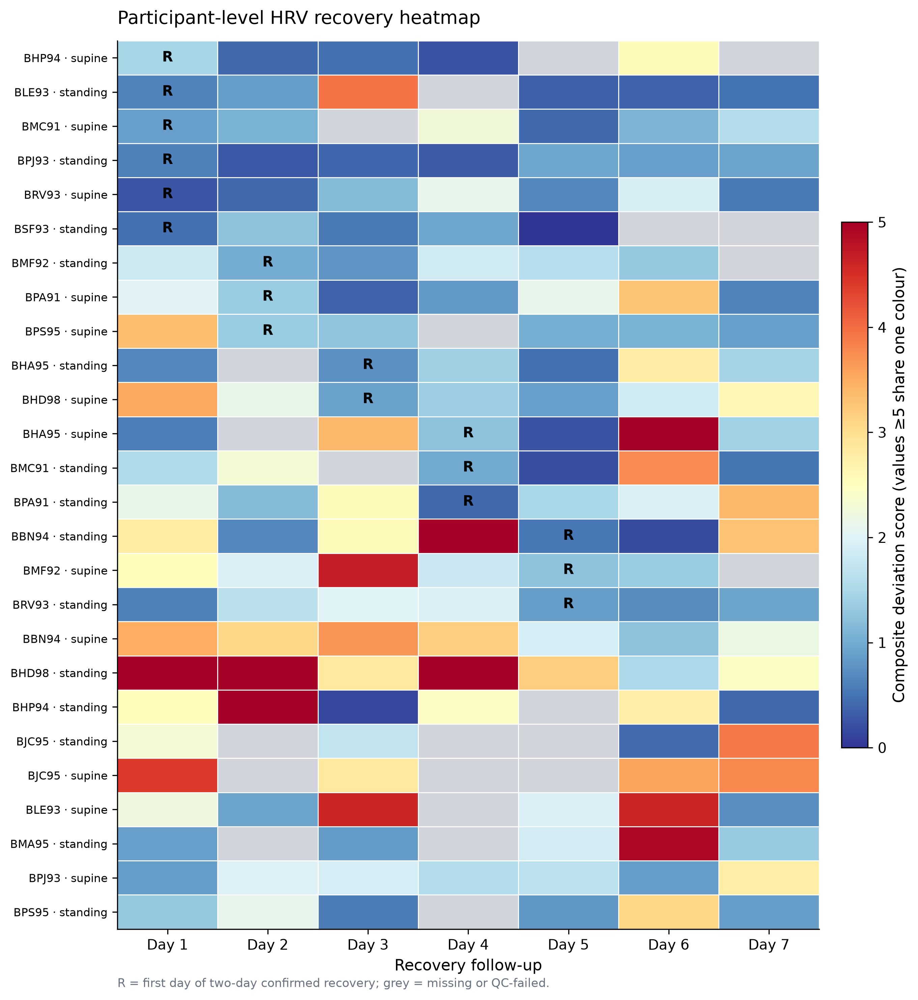
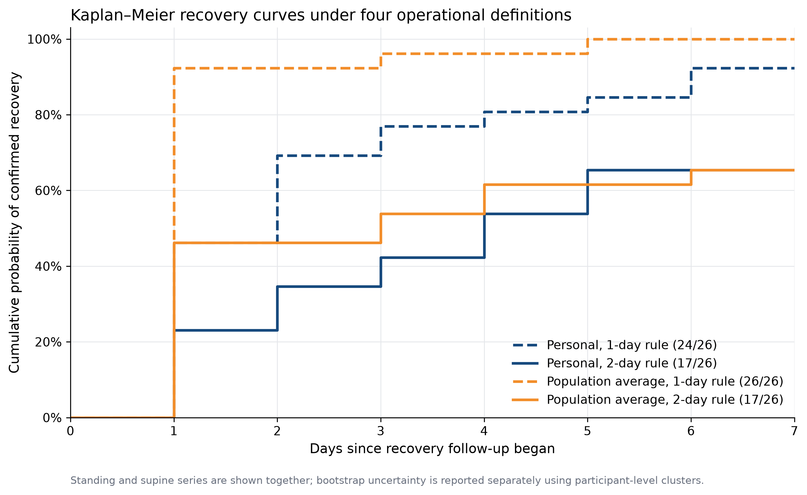

# estimate-recovery-time-for-patient

**Personal estimation of recovery after shift work using longitudinal wearable data**

`estimate-recovery-time-for-patient` is a reproducible Python toolkit. It estimates how many days a person needs to return to their own baseline after shift work.

This project comes from my research on eating patterns in police officers who work shifts. In this research, I found that there is still a lack of methods to calculate recovery time after different shift patterns.

This project uses the same idea of analysing data over time. It applies this idea to wearable data, including sleep, heart rate, and activity data.

The main question is:

> After the last shift in a work period, how many days does a person need to return to their normal physical and behavioural state?


## What I did

Two public datasets are used. The Mauvieux dataset provides sleep results from three study stages. These data can be used to compare changes between the stages. The Bourdillon dataset comes from an experiment with a baseline period, a partial sleep deprivation period, and a recovery period. It provides daily RR interval records. The RR intervals are checked for data quality and then converted into NN intervals. RMSSD and SDNN are then calculated for different body positions. A personal HRV baseline and normal range are created from each participant’s baseline condition. The recovery data are arranged from day 1 to day 7. The difference between each recovery day and the personal baseline is then calculated. Missing data are excluded from this calculation.

Recovery is defined as two consecutive days within the normal range. The first of these two days is recorded as the recovery day. If recovery is not observed before the end of follow-up, the record is treated as right-censored. Four recovery thresholds are used to check whether the results are stable. Personal baselines are compared with the population average baseline. A one-day recovery rule is also compared with a two-day recovery rule. Bootstrap resampling is performed at the participant level. It provides uncertainty intervals for the recovery proportion and recovery time. The final results include a study timeline, individual recovery trajectories, a recovery-day heatmap, and Kaplan–Meier recovery curves.


## Quick start Python 3.10

```bash
python -m venv .venv
python -m pip install -e .
python -m shiftrecover.cli demo --output-dir results/demo
python -m unittest discover -s tests -v
```

After downloading and extracting the Mauvieux files:

```bash
python -m shiftrecover.cli mauvieux \
  --data-dir "data/Exercise, circadian rhythms & night work" \
  --output-dir results/mauvieux
```

After downloading the Bourdillon RR release:

```bash
python -m shiftrecover.cli bourdillon \
  --data-dir "data/raw/bourdillon_2020/RR" \
  --output-dir results/bourdillon

python -m shiftrecover.cli bourdillon-hrv \
  --input-file "results/bourdillon/bourdillon_rr_tidy.csv" \
  --output-dir results/bourdillon_hrv

python -m shiftrecover.cli bourdillon-baseline \
  --input-file "results/bourdillon_hrv/bourdillon_daily_hrv.csv" \
  --output-dir results/bourdillon_baseline

python -m shiftrecover.cli bourdillon-deviation \
  --hrv-file "results/bourdillon_hrv/bourdillon_daily_hrv.csv" \
  --baseline-file "results/bourdillon_baseline/bourdillon_personal_hrv_baselines.csv" \
  --output-dir results/bourdillon_deviation

python -m shiftrecover.cli bourdillon-recovery \
  --deviation-file "results/bourdillon_deviation/bourdillon_recovery_daily_deviation.csv" \
  --output-dir results/bourdillon_recovery \
  --threshold 1.5 \
  --consecutive-days 2

python -m shiftrecover.cli bourdillon-sensitivity \
  --deviation-file "results/bourdillon_deviation/bourdillon_recovery_daily_deviation.csv" \
  --output-dir results/bourdillon_sensitivity \
  --thresholds 0.75 1.0 1.5 2.0 \
  --consecutive-days 2

python -m shiftrecover.cli bourdillon-comparison \
  --hrv-file "results/bourdillon_hrv/bourdillon_daily_hrv.csv" \
  --personal-baseline-file "results/bourdillon_baseline/bourdillon_personal_hrv_baselines.csv" \
  --personal-deviation-file "results/bourdillon_deviation/bourdillon_recovery_daily_deviation.csv" \
  --output-dir results/bourdillon_comparison \
  --threshold 1.5

python -m shiftrecover.cli bourdillon-bootstrap \
  --event-file "results/bourdillon_comparison/bourdillon_method_comparison_events.csv" \
  --output-dir results/bourdillon_bootstrap \
  --replicates 2000 \
  --seed 20260914 \
  --horizon-days 7

python -m shiftrecover.cli bourdillon-figures \
  --hrv-file "results/bourdillon_hrv/bourdillon_daily_hrv.csv" \
  --deviation-file "results/bourdillon_deviation/bourdillon_recovery_daily_deviation.csv" \
  --event-file "results/bourdillon_comparison/bourdillon_method_comparison_events.csv" \
  --output-dir docs/figures
```

## Documentation

More information about data processing, HRV calculation, recovery analysis, figures, and testing is available in the [`docs` folder](docs/).

## Core figures

### Experimental timeline



### Individual recovery trajectories



### Participant recovery heatmap



### Kaplan–Meier recovery comparison



The demo creates:

- `synthetic_daily.csv`: participant-day wearable features and shifts;
- `personal_baselines.csv`: each participant's feature centres and scales;
- `daily_deviation_scores.csv`: standardized deviations from baseline;
- `recovery_events.csv`: estimated recovery time after every night-shift block.


## How recovery is defined

Each participant is compared with their own baseline. A daily score shows how far the participant is from their normal range. Recovery requires two consecutive off-duty days within the chosen range. The first of these two days is recorded as the recovery day. If a new work period starts or follow-up ends before recovery, the observation is right-censored.


## Data

Data access instructions are available in [docs/DATA_DOWNLOAD_CN.md](docs/DATA_DOWNLOAD_CN.md).

The standard output fields and data reading rules for the Bourdillon dataset are available in [docs/BOURDILLON_DATA_DICTIONARY.md](docs/BOURDILLON_DATA_DICTIONARY.md).

- **Mauvieux 2025**: The data can be downloaded directly. They are available under the CC BY 4.0 licence. The dataset includes sleep measures and circadian rhythm measures from three study stages. It also includes fitted curves for the study group.

- **TILES-2018**: This study followed 212 hospital workers for about ten weeks. The data include sleep, heart rate, and steps recorded by Fitbit. They also include workday information.

- **Bourdillon 2021**: This dataset provides RR interval data from morning posture tests. The study included a one-week baseline period, three nights of partial sleep deprivation, and a one-week recovery period.


## Repository layout

```text
ShiftRecoverPy/
├── docs/
│   ├── BASELINE_METHODS.md
│   ├── BOOTSTRAP_METHODS.md
│   ├── BOURDILLON_DATA_DICTIONARY.md
│   ├── DATA_DOWNLOAD_CN.md
│   ├── DEVIATION_METHODS.md
│   ├── FIGURE_METHODS.md
│   ├── HRV_METHODS.md
│   ├── METHOD_COMPARISON_METHODS.md
│   ├── PROJECT_PLAN_CN.md
│   ├── RECOVERY_EVENT_METHODS.md
│   ├── TESTING.md
│   └── THRESHOLD_SENSITIVITY_METHODS.md
├── src/shiftrecover/
│   ├── baseline.py
│   ├── bourdillon.py
│   ├── bootstrap.py
│   ├── circular.py
│   ├── cli.py
│   ├── comparison.py
│   ├── deviation.py
│   ├── hrv.py
│   ├── plotting.py
│   ├── recovery.py
│   ├── recovery_time.py
│   ├── sensitivity.py
│   └── simulate.py
├── tests/
├── data/raw/          # ignored by Git
├── results/           # ignored by Git
└── pyproject.toml
```

## Interpretation of results

This project uses the defined method to estimate a patient’s recovery time. The relationship between recovery time and health outcomes is observational. It should not be interpreted as a causal relationship.

## Licence

The project code is released under the MIT License. Each source dataset remains subject to its own terms of use.
